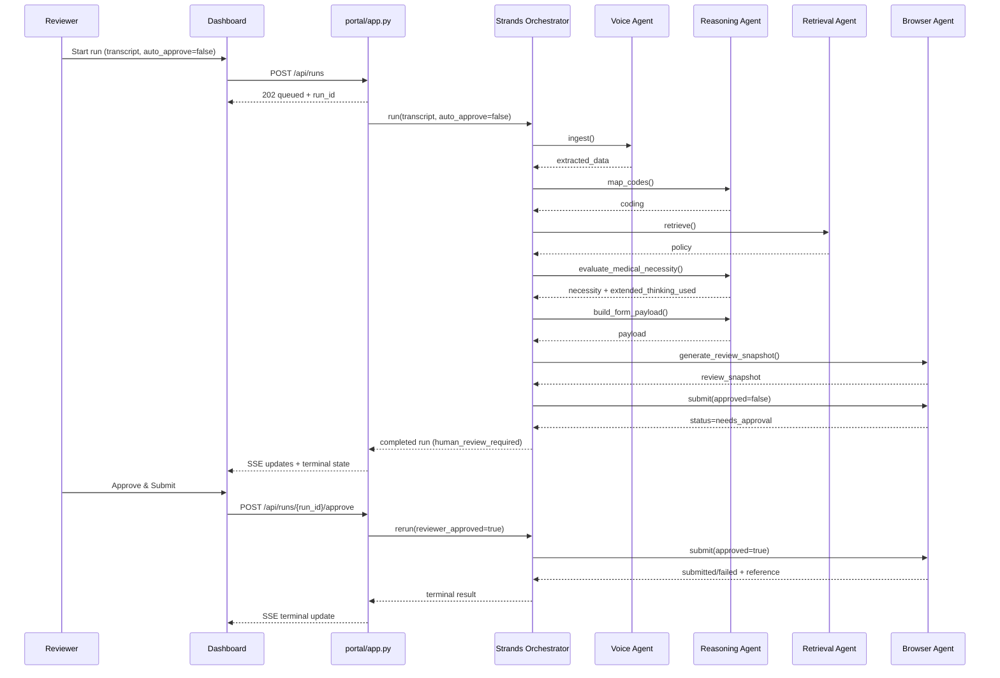

# PriorAuth Agent System Architecture

## 1) Architecture Goal (Judge-Facing)
This architecture is optimized for the **Technical Implementation (60%)** judging criteria:

- Quality and robustness of implementation
- Effective end-to-end execution
- Real integration with Amazon Nova / Bedrock services
- Clear, modular system design with observable workflow execution

## 2) High-Level Component Architecture

```mermaid
flowchart LR
    U[Clinician / Reviewer] --> D[Dashboard UI<br/>portal/templates/dashboard.html]
    U --> F[Mock Payer Form UI<br/>portal/templates/pa_form.html]

    D --> API[Flask Control Plane<br/>portal/app.py]
    API --> SSE[SSE Stream<br/>/api/runs/{id}/events]
    SSE --> D

    API --> RUNS[(In-memory Run Store<br/>workflow_runs)]
    API --> ORCH_FACTORY[Orchestrator Factory<br/>agents/orchestrator_factory.py]
    ORCH_FACTORY --> STRANDS_ORCH[StrandsPriorAuthOrchestrator<br/>agents/strands_orchestrator.py]
    ORCH_FACTORY --> LEGACY_ORCH[PriorAuthOrchestrator<br/>agents/orchestrator.py]

    STRANDS_ORCH --> VOICE[VoiceIntakeAgent]
    STRANDS_ORCH --> REASON[ClinicalReasoningAgent]
    STRANDS_ORCH --> RETRIEVE[PayerPolicyRetrievalAgent]
    STRANDS_ORCH --> BROWSER[BrowserAutomationAgent]

    REASON --> NOVA_RUNTIME[(Bedrock Runtime<br/>Nova Lite Converse)]
    RETRIEVE --> KB_RUNTIME[(Bedrock Agent Runtime<br/>Knowledge Base Retrieve)]
    RETRIEVE --> LOCAL_POLICIES[(Local Policies JSON)]
    BROWSER --> SUBMIT[/POST /submit<br/>mock payer portal/]

    KB_RUNTIME --> KB[(Bedrock Knowledge Base ID)]
    KB --> AOSS[(OpenSearch Serverless Vector Index)]
    KB --> S3[(S3 Policy Documents)]
```

## 3) Workflow Sequence (Run + HITL Approval)



## 4) Core Modules and Responsibilities

| Module | Responsibility | File |
|---|---|---|
| Control Plane API | Run queueing, async execution, SSE streaming, approval endpoint | `portal/app.py` |
| Orchestrator Selection | Choose `strands` vs `legacy` execution path | `agents/orchestrator_factory.py` |
| Strands Orchestration | Stage-based agent execution + spans + trace events | `agents/strands_orchestrator.py` |
| Voice Intake | Extract structured clinical fields from transcript | `agents/voice_agent.py` |
| Clinical Reasoning | Code mapping, necessity evaluation, justification generation | `agents/reasoning_agent.py` |
| Policy Retrieval | Bedrock KB retrieval with local fallback | `agents/retrieval_agent.py` |
| Browser Submission | Playwright / Nova Act / HTTP adapter submission | `agents/browser_agent.py` |
| Type Contracts | Shared workflow DTOs and serialization | `agents/types.py` |
| KB Provisioning | S3 + AOSS + Bedrock KB provisioning script | `knowledge_base/create_bedrock_kb.py` |

## 5) Amazon Nova / Bedrock Integration Points

1. **Nova reasoning and justification** through Bedrock Runtime `converse`
2. **Strands Agents orchestration** with `BedrockModel(model_id="amazon.nova-lite-v1:0")`
3. **Bedrock Knowledge Base retrieval** via `bedrock-agent-runtime.retrieve(...)`
4. **Structured observability**:
   - Workflow trace (SSE-visible)
   - OpenTelemetry stage spans (`voice_intake`, `knowledge_retrieval`, `portal_submission`, etc.)

## 6) Reliability and Engineering Quality Patterns

- **Fallback strategy**
  - Orchestration fallback: Strands -> legacy if unavailable
  - Retrieval fallback: Bedrock KB -> local policies
  - Justification fallback: extended reasoning -> standard inference
- **HITL safety gate**
  - Explicit `needs_approval` state
  - Reviewer action endpoint to resume submission
- **Type safety**
  - Protocol-based Bedrock client typing to avoid `None` call-site issues
- **Test coverage**
  - API tests for run creation/SSE/approval loop
  - Pipeline tests for extraction, retrieval, coding guardrails, necessity

## 7) Observability Model

- **Run-level trace**: step/status/detail/timestamp
- **Span-level trace** (OTel): per orchestration stage with business attributes
- **Business visibility field**: `necessity.extended_thinking_used`

## 8) Current Technical Boundaries (Honest Submission Framing)

- Voice intake currently parses transcript text; live Sonic microphone streaming is a next step.
- KB provisioning currently uses Titan Text Embeddings v2 for Bedrock KB compatibility constraints.
- Bedrock Guardrails API integration is a planned enhancement.

## 9) Suggested “Technical Implementation” Demo Script

1. Start run from dashboard (`auto_approve=false`).
2. Show live SSE trace as each stage completes.
3. Open structured JSON and highlight:
   - `orchestrator_mode: "strands"`
   - `retrieval_source`
   - `necessity.extended_thinking_used`
4. Show `Human Review Snapshot`.
5. Click `Approve & Submit`.
6. Show resumed run and final submission status/reference.
7. Point to terminal OTel spans for stage-level execution evidence.
